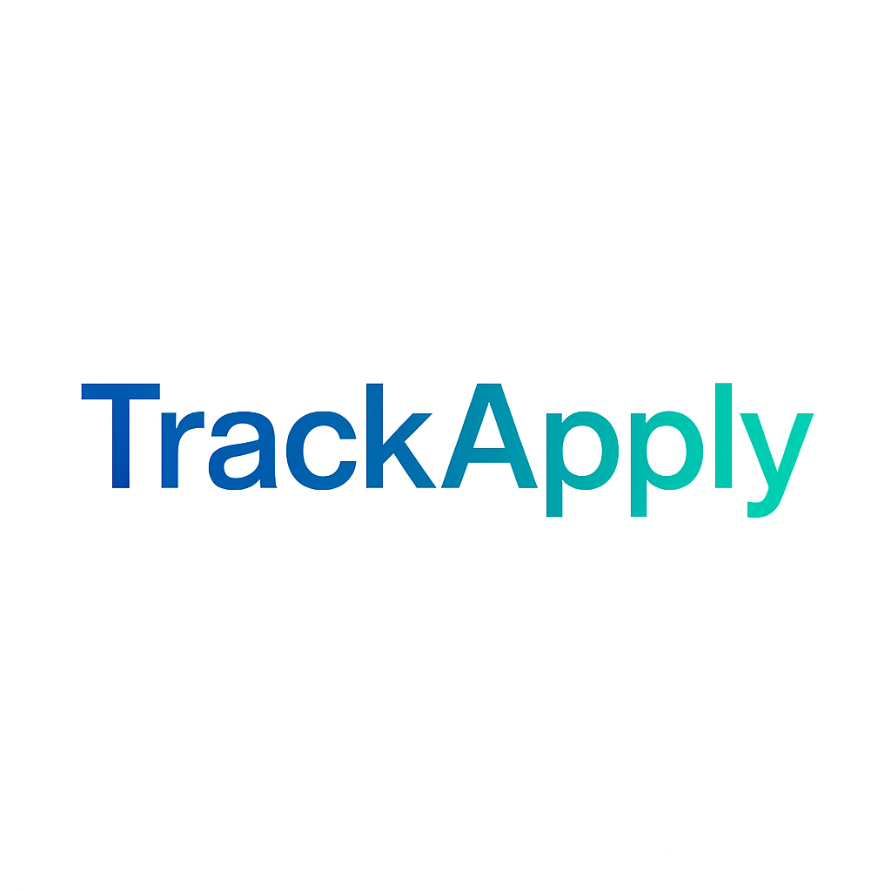

# TrackApply 📊

A modern, responsive web application built with Flask to help job seekers track and organize their job applications in one centralized location.



## 🚀 Quick Deploy

[](https://heroku.com/deploy?template=https://github.com/Shadshere/Track-Apply)

## ✨ Features

- **📝 Application Management**: Add, edit, and delete job applications
- **📊 Dashboard**: Visual statistics and overview of application status
- **🏷️ Status Tracking**: Track applications through different stages (Applied, Under Review, Interview, Offer, Rejected)
- **📱 Mobile-Friendly**: Responsive design that works on all devices
- **🎨 Modern UI**: Beautiful gradient design with smooth animations
- **📝 Notes System**: Add detailed notes for each application
- **🔍 Easy Navigation**: Clean, intuitive interface

## 🚀 Getting Started

### Prerequisites

- Python 3.7 or higher
- pip (Python package installer)

### Quick Setup

1. **Clone the repository**
   ```bash
   git clone https://github.com/yourusername/TrackApply.git
   cd TrackApply
   ```

2. **Install dependencies**
   ```bash
   pip install -r requirements.txt
   ```

3. **Run the application**
   ```bash
   python app.py
   ```

4. **Open your browser and navigate to**
   ```
   http://localhost:5000
   ```

### Alternative Setup (Virtual Environment - Recommended)

1. **Clone the repository**
   ```bash
   git clone https://github.com/yourusername/TrackApply.git
   cd TrackApply
   ```

2. **Create a virtual environment**
   ```bash
   python -m venv venv
   ```

3. **Activate the virtual environment**
   - On Windows:
     ```bash
     venv\Scripts\activate
     ```
   - On macOS/Linux:
     ```bash
     source venv/bin/activate
     ```

4. **Install required packages**
   ```bash
   pip install -r requirements.txt
   ```

5. **Run the application**
   ```bash
   python app.py
   ```

## 📱 Usage

### Adding a New Application
1. Click the "Add New Application" button on the dashboard
2. Fill in the required information:
   - Company Name
   - Job Title
   - Application Date
   - Status (optional, defaults to "Applied")
   - Notes (optional)
3. Click "Add Application" to save

### Managing Applications
- **View All**: The dashboard shows all your applications in a clean table
- **Edit**: Click the pencil icon to modify application details
- **Delete**: Click the trash icon to remove an application
- **Status Updates**: Use the edit function to update application status as you progress

### Dashboard Statistics
The dashboard provides an overview of:
- Total number of applications
- Number of interviews scheduled
- Pending applications (Applied + Under Review)
- Job offers received

## 🎨 Design Features

- **Modern Gradient Design**: Beautiful color gradients throughout the interface
- **Responsive Layout**: Works perfectly on desktop, tablet, and mobile devices
- **Interactive Elements**: Smooth hover effects and animations
- **Status Badges**: Color-coded status indicators for quick recognition
- **Clean Typography**: Easy-to-read fonts and proper spacing

## 🛠️ Technology Stack

- **Backend**: Flask (Python web framework)
- **Database**: SQLite (lightweight, file-based database)
- **Frontend**: HTML5, CSS3, JavaScript
- **Styling**: Bootstrap 5 + Custom CSS
- **Icons**: Bootstrap Icons

## 📊 Database Schema

The application uses a simple SQLite database with the following structure:

```sql
applications (
    id INTEGER PRIMARY KEY AUTOINCREMENT,
    company_name TEXT NOT NULL,
    job_title TEXT NOT NULL,
    application_date DATE NOT NULL,
    status TEXT NOT NULL DEFAULT 'Applied',
    notes TEXT,
    created_at TIMESTAMP DEFAULT CURRENT_TIMESTAMP,
    updated_at TIMESTAMP DEFAULT CURRENT_TIMESTAMP
)
```

## 📁 Project Structure

```
TrackApply/
├── app.py                 # Main Flask application
├── requirements.txt       # Python dependencies
├── trackApply.db         # SQLite database (created automatically)
├── templates/            # Jinja2 HTML templates
│   ├── base.html         # Base template
│   ├── index.html        # Dashboard page
│   ├── add.html          # Add application form
│   └── edit.html         # Edit application form
├── static/               # Static assets
│   ├── css/
│   │   └── style.css     # Custom CSS with gradients
│   ├── js/
│   │   └── main.js       # JavaScript functionality
│   └── images/
│       └── logo.png      # TrackApply logo
└── .github/
    └── copilot-instructions.md
```

## 🔧 Configuration

The application uses the following default settings:
- **Host**: 0.0.0.0 (accessible from all network interfaces)
- **Port**: 5000
- **Debug Mode**: Enabled (disable in production)
- **Database**: trackApply.db (SQLite file)

## 🚀 Deployment

For production deployment:

1. **Set a secure secret key** in `app.py`
2. **Disable debug mode** by setting `debug=False`
3. **Use a production WSGI server** like Gunicorn
4. **Configure environment variables** for sensitive data

## 🤝 Contributing

This is a personal project, but suggestions and improvements are welcome! Feel free to:
- Report bugs
- Suggest new features
- Submit pull requests

## 📄 License

This project is open source and available under the [MIT License](LICENSE).

## 🎯 Future Enhancements

Potential features for future versions:
- Data export to CSV/PDF
- Email notifications for follow-ups
- Interview scheduling integration
- Application analytics and insights
- Dark theme option
- User authentication for multi-user support

---

**Happy Job Hunting! 🎯**

Built with ❤️ for job seekers everywhere.
